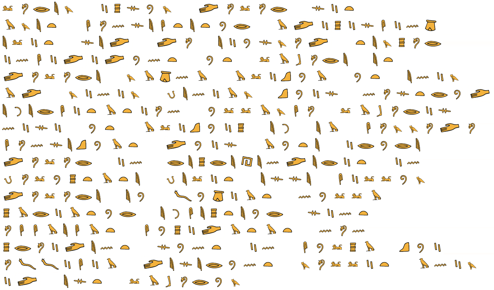

# Cipher

## Description

A project to cipher information according according to the cipher wheels of
<https://www.osi.es/sites/default/files/docs/c9-pdf-rp-rueda-cifrado.pdf>

## Content

- [Cipher](#cipher)
  - [Description](#description)
  - [Content](#content)
  - [Requirements](#requirements)
  - [Setup](#setup)
  - [Usage](#usage)
    - [Symbolic cipher](#symbolic-cipher)
    - [Caesar cipher](#caesar-cipher)
    - [Numeric cipher](#numeric-cipher)
    - [Help messages](#help-messages)
      - [Symbolic cipher](#symbolic-cipher-1)
      - [Caesar cipher](#caesar-cipher-1)
      - [Numeric cipher](#numeric-cipher-1)

## Requirements

- `python 3.10+`
- `pip`
- `venv` (recommended)

## Setup

```shell
python3 -m venv .venv
source ./.venv/Scripts/activate
python -m pip install -r requirements.txt
```

## Usage

### Symbolic cipher

```console
$ ./cipher.py symbolic 'abcdefghijklmnopqrstuvwzyz'

encripted_message_b3ad1125-f683-4aac-8481-ff1155c74110.png
```


```console
$ ./cipher.py symbolic 'Lorem ipsum dolor sit
amet consectetur adipiscing
elit sed do eiusmod tempor
incididunt ut labore et
dolore magna aliqua Ut enim
ad minim veniam quis nostrud
exercitation ullamco laboris
nisi ut aliquip ex ea commodo
consequat Duis aute irure
dolor in reprehenderit in
voluptate velit esse cillum
dolore eu fugiat nulla
pariatur Excepteur sint
occaecat cupidatat non
proident sunt in culpa qui
officia deserunt mollit anim
id est laborum'

encripted_message_d50710bd-7d4a-4aaf-b0c8-887a78cc5292.png
```



### Caesar cipher

```console
$ ./cipher.py caesar --shift=5 'abcdefghijklmnopqrstuvwzyz'

fghijklmnopqrstuvwxyzabcde
```

```console
$  ./cipher.py caesar --shift=5 'Lorem ipsum dolor sit amet, consectetur adipiscing
elit, sed do eiusmod tempor incididunt ut labore et dolore magna aliqua. Ut enim ad
minim veniam, quis nostrud exercitation ullamco laboris nisi ut aliquip ex ea
commodo consequat. Duis aute irure dolor in reprehenderit in voluptate velit esse
cillum dolore eu fugiat nulla pariatur. Excepteur sint occaecat cupidatat non
proident, sunt in culpa qui officia deserunt mollit anim id est laborum.'

Qtwjr nuxzr itqtw xny frjy, htsxjhyjyzw finunxhnsl
jqny, xji it jnzxrti yjrutw nshninizsy zy qfgtwj jy itqtwj rflsf fqnvzf. Zy jsnr fi
rnsnr ajsnfr, vznx stxywzi jcjwhnyfynts zqqfrht qfgtwnx snxn zy fqnvznu jc jf
htrrtit htsxjvzfy. Iznx fzyj nwzwj itqtw ns wjuwjmjsijwny ns atqzuyfyj ajqny jxxj
hnqqzr itqtwj jz kzlnfy szqqf ufwnfyzw. Jchjuyjzw xnsy thhfjhfy hzunifyfy sts
uwtnijsy, xzsy ns hzquf vzn tkknhnf ijxjwzsy rtqqny fsnr ni jxy qfgtwzr.
```

### Numeric cipher

```console
$ ./cipher.py numeric 'abcdefghijklmnopqrstuvwzyz'

11 21 31 41 51 12 22 32 42 52 13 23 33 43 14 24 13 34 44 54 15 22 25 55 45 55
```

```console
$ ./cipher.py numeric 'Lorem ipsum dolor sit
amet consectetur adipiscing
elit sed do eiusmod tempor
incididunt ut labore et
dolore magna aliqua Ut enim
ad minim veniam quis nostrud
exercitation ullamco laboris
nisi ut aliquip ex ea commodo
consequat Duis aute irure
dolor in reprehenderit in
voluptate velit esse cillum
dolore eu fugiat nulla
pariatur Excepteur sint
occaecat cupidatat non
proident sunt in culpa qui
officia deserunt mollit anim
id est laborum'
23 14 34 51 33   42 24 44 15 33   41 14 23 14 34   44 42 54
11 33 51 54   31 14 43 44 51 31 54 51 54 15 34   11 41 42 24 42 44 31 42 43 22
51 23 42 54   44 51 41   41 14   51 42 15 44 33 14 41   54 51 33 24 14 34
42 43 31 42 41 42 41 15 43 54   15 54   23 11 21 14 34 51   51 54
41 14 23 14 34 51   33 11 22 43 11   11 23 42 13 15 11   15 54   51 43 42 33
11 41   33 42 43 42 33   22 51 43 42 11 33   13 15 42 44   43 14 44 54 34 15 41
51 35 51 34 31 42 54 11 54 42 14 43   15 23 23 11 33 31 14   23 11 21 14 34 42 44
43 42 44 42   15 54   11 23 42 13 15 42 24   51 35   51 11   31 14 33 33 14 41 14
31 14 43 44 51 13 15 11 54   41 15 42 44   11 15 54 51   42 34 15 34 51
41 14 23 14 34   42 43   34 51 24 34 51 32 51 43 41 51 34 42 54   42 43
22 14 23 15 24 54 11 54 51   22 51 23 42 54   51 44 44 51   31 42 23 23 15 33
41 14 23 14 34 51   51 15   12 15 22 42 11 54   43 15 23 23 11
24 11 34 42 11 54 15 34   51 35 31 51 24 54 51 15 34   44 42 43 54
14 31 31 11 51 31 11 54   31 15 24 42 41 11 54 11 54   43 14 43
24 34 14 42 41 51 43 54   44 15 43 54   42 43   31 15 23 24 11   13 15 42
14 12 12 42 31 42 11   41 51 44 51 34 15 43 54   33 14 23 23 42 54   11 43 42 33
42 41   51 44 54   23 11 21 14 34 15 33
```

### Help messages

#### Symbolic cipher

```console
$ ./cipher.py symbolic --help
INFO: Showing help with the command 'cipher.py symbolic -- --help'.

NAME
    cipher.py symbolic - Ciphers plain_text using a symbolic cipher

SYNOPSIS
    cipher.py symbolic PLAIN_TEXT <flags>

DESCRIPTION
    This cipher is case insensitive.
    Only letter characters and whitespace are supported.

POSITIONAL ARGUMENTS
    PLAIN_TEXT
        Type: str

FLAGS
    --tab_size=TAB_SIZE
        Type: int
        Default: 4

NOTES
    You can also use flags syntax for POSITIONAL ARGUMENTS
```

#### Caesar cipher

```console
$ ./cipher.py caesar --help
INFO: Showing help with the command 'cipher.py caesar -- --help'.

NAME
    cipher.py caesar - Ciphers plain_text using a caesar cipher

SYNOPSIS
    cipher.py caesar PLAIN_TEXT <flags>

DESCRIPTION
    This cipher is case sensitive.
    Non letter characters will not be ciphered.

POSITIONAL ARGUMENTS
    PLAIN_TEXT
        Type: str

FLAGS
    --shift=SHIFT
        Type: int
        Default: 5

NOTES
    You can also use flags syntax for POSITIONAL ARGUMENTS
```

#### Numeric cipher

```console
$ ./cipher.py numeric --help
NAME
    cipher.py numeric - Ciphers plain_text using a numeric cipher

SYNOPSIS
    cipher.py numeric PLAIN_TEXT

DESCRIPTION
    This cipher is case insensitive.
    Non letter characters will not be ciphered.

POSITIONAL ARGUMENTS
    PLAIN_TEXT
        Type: str

NOTES
    You can also use flags syntax for POSITIONAL ARGUMENTS
```
